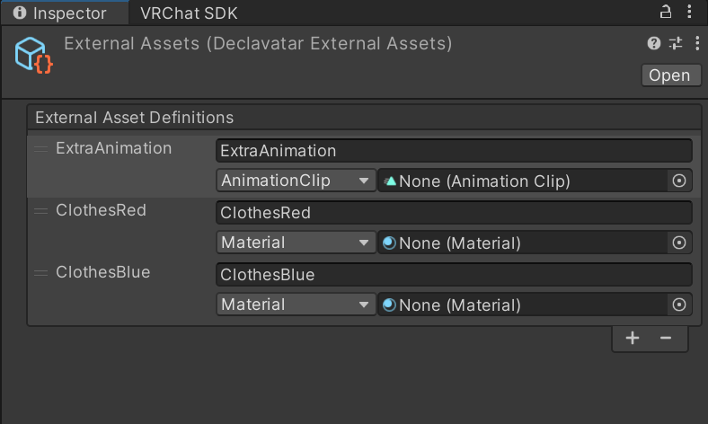

# 外部アセット

declavatar で生成可能なアニメーションにはマテリアル切り替えなどが含まれますが、これは declavatar から直接生成することはできません。
他にも既に Hierarchy に存在している GameObject など、原理的にビルド時に生成できない `UnityEngine.Object` のサブクラスのインスタンスなどを指定したい場面が存在します。

外部アセット (DeclavatarExternalAssets) は、そのようなアセットや GameObject とそれをアバター定義の中で参照する名前の組を管理する ScriptableObject です。
現状では以下の種類のオブジェクトを指定できます。

* マテリアル (`Material`)
* アニメーション (`AnimationClip`)
* 音声ファイル (`AudioClip`)
* アバターマスク (`AvatarMask`)
* Hierarchy 上のオブジェクト (`GameObject`)



定義ファイル内では、 `da/assets` ブロックで使用するアセットを予め明示的に宣言する必要があります。

```scheme
(da/assets
  (da/animation "ExtraAnimation")
  (da/material "ClothesRed")
  (da/material "ClothesBlue")
)
```
