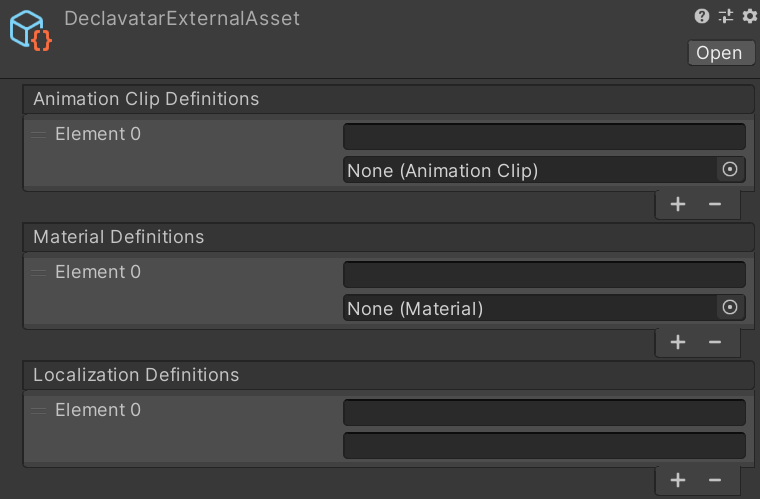

# DeclavatarExternalAssets アセット

定義ファイルから生成されない、ユーザーから提供するアセット類を定義します。
いずれのアセットについても各要素のうち上が定義名、下が実際のアセットとなっています。

## `Animation Clip Definitions` (アニメーションファイル)

Raw Layer で使う AnimationClip アセットを指定します。

## `Material Definitions` (マテリアル)

マテリアル切り替えで実際に使うマテリアルを指定します。

## `Localization Definitions` (文字列置換)

将来のために予約されています。
