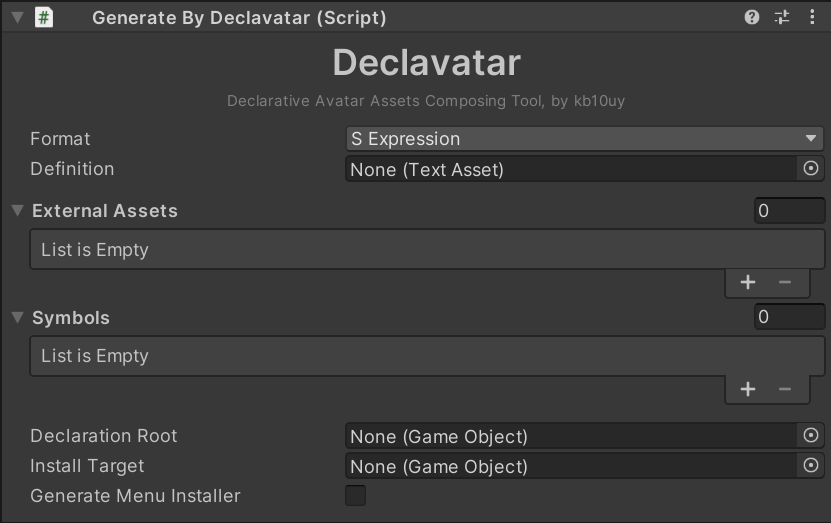

# Generate By Declavatar コンポーネント

declavatar のメインとなるコンポーネントです。

## `Format` (定義ファイル形式)

定義ファイルの形式を選択します。
定義ファイルとしては任意の TextAsset を受け付けるほか、拡張子によって判定されることはありません。
任意のファイル形式に対して好きな拡張子を使用できます。

1.0.0 現在 `S Expression` (S 式) と `Lua` が選択できますが、前者のみがサポートされています。

## `Definition` (定義ファイルアセット)

定義ファイルの TextAsset を指定します。
指定されていない場合はこのコンポーネント自体がないものとして扱われます。

## `Declaration Target` (ルートオブジェクト)

アセット生成時にルートとなる GameObject を指定します。いわゆるアバタールートや衣装ルートと呼ばれるものになります。
指定されていない場合はこのコンポーネントが追加されている GameObject がルートとみなされます。

## `Install Target` (メニューインストール先)

Expressions Menu を生成する [MA Menu Group コンポーネント](https://modular-avatar.nadena.dev/ja/docs/reference/menu-group) が生成されるGameObject を指定します。
指定されていない場合はこのコンポーネントが追加されている GameObject の子に `DeclavatarMenu` という GameObject が生成されそれが Target になります。

Generate By Declavatar コンポーネントどうしや他の [MA MenuInstaller コンポーネント](https://modular-avatar.nadena.dev/ja/docs/reference/menu-install-target) を生成するようなツール・ギミックとのあいだで順序を調整したい場合に便利です。

## `External Assets` (外部アセットリスト)

[DeclavatarExternalAsset](./external-assets.md) を指定します。複数セットすることが可能で、先頭から順番に検索対象になります。
