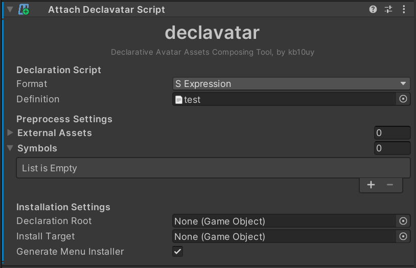
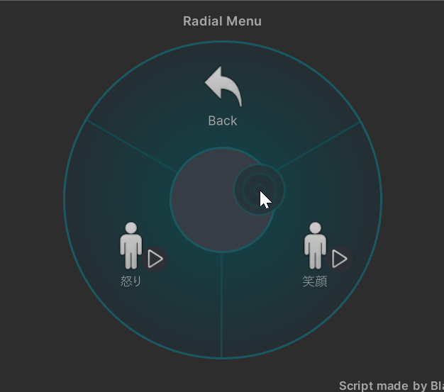

# アバターに定義ファイルをアタッチする

最後に、記述した定義ファイルをアバターにアタッチして組み込みましょう。

アバタールートの GameObject を選択し、 Add Component から `Attach Declavatar Script` を探して追加します。

画像のようなコンポーネントが出てくるので、以下のとおりに設定します。

* **Definition フィールド** : 作った定義ファイルの TextAsset を指定する
* **Generate Menu Installer** : チェックする

これでアバターをビルドすれば、記述した組み込まれてメニューから表情が操作できるようになっているはずです。
おつかれさまでした！

## 動かなかったとき

### NDMF コンソールにエラー表示が出た場合

declavavatar は、検出されたエラーについては NDMF コンソールに表示するようになっています。
表示された内容にしたがって修正してください……と言いたいところですが、現在実装上の制約により一部で詳しい情報が出せないエラーがあります。
それらについて想定される具体的な修正内容は以下のとおりです。

* `name not found in global scope`
  - `da/group-layer` などのブロック名を間違っている箇所がある。
* `missing close paren`
  - カッコが足りていない。
  - どのカッコが足りていないかは indent-rainbow などの拡張機能を活用していただくしかなく……
* `unexpected value passed; X expected, Y found`
  - `X` しか書けない場所に `Y` が書かれている。
  - おそらくブロックを記述する場所を間違えている。
  - カッコミスと併合してありがち。

### NDMF コンソールにエラー表示が出ない場合

この場合、ビルド自体には成功していて実際のアニメーションがはたらいていないということになります。
最も多いのはシェイプキー名の指定ミスです。全角半角やスペースの有無などを確認してみてください。
